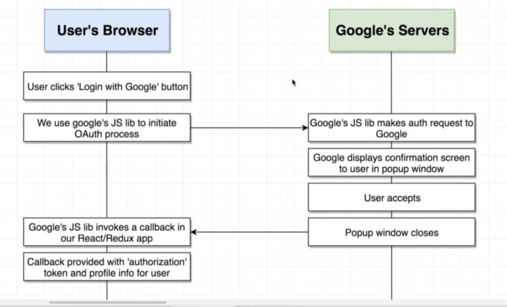

### Notes

## React Router Dom

1. Do not use anchor tags to handle navigation because everytime you click on the link you make a request for an entirely new html document and that dumps all the data that was loaded into the react and redux application. Use the Link component that react-router-dom provides.

- When using the Link component from react-router-dom, React Router prevents the browser from navigating to the new page and fetching a new html file

- React Router sees the updated URL, takes it and send it to the BrowserRouter

- The BrowserRouter communicates the URL to the Route components

- The Route components rerenders and shows the new set of components

2. BrowserRouter uses everything after the .com .net or port as the 'path' (Ex: https://somedomain.com/path)

3. HashRouter uses everything after a # as the 'path' (Ex: https://somedomain.com/#/path)

4. MemoryRouter doesn't use the URL to track navigation (Ex: https://somedomain.com/). There is no path displayed when you navigate to different links.

## Create React App Dev Server

If a path doesn't exist in your application the react app dev server will:

- check the dev resources
- check the public dir
  If there is no match to the path then it'll server up the index.html file instead of a 404 error.

## Authentication

### Traditional Email/Password Authentication

1. We store a record in a database with the user's email and password
2. When the user tires to login, we compare the email/password with whats stored in the database
3. A user is "logged in" when they enter the correct email/password

### OAth Authentication

1. User authenticates with outside service provider (google, linkedIn, facebook)
2. User authorizes our app to access their information
3. Outside provider tells us about the user
4. We are trusting the outside provider to correctly handle identification of a user
5. OAuth can be used for

- user identfication in our app
- our app making actions on behalf of user.
  Google has a list of scopes you can ask your user to give you access to.

### OAuth for Servers

1. After user logs in a token is received that a server can use to make requests on behalf of the user
2. This approach is usually used when we have an app that needs to access user data **when they are not logged in**
3. This process is difficult to setup because we need to store a lot of info about the user

### OAuth for JS Browser Apps

1. After user logs in a token is received that a browser app can use to make requests on behalf of the user
2. This approach is usually used when we have an app that only needs to access user data **while they are logged in**
3. This process is very easy to setup thanks to google's JS lib to automate flow

### Authentication flow with google

At the end you get a token and the profile info of the user

When the user logs out another callback gets invoked that lets your application know that the user has logged out. So we must wire up the application to listen for that callback as well.

### General steps to setup OAuth with google

1. Creat a new project (here)[console.developers.google.com]
2. Set up an OAuth client ID
3. Generate an OAuth client ID
4. install google's API library in your application and initialize it with the OAuth client ID
   (google's API library can't be installed through npm so we are going to add `` to the index.html file in the public folder)
5. Make sure the lib gets called any time the user clicks on the 'Login with google' button

_How google's API library works_

1. After add the script google's API `gapi` is will be located in the windows object of the browser and it's a multi-purpose google api library

- you can use to interact with the OAuth flow
- you can also use it to work with all different types of google services

2. To use google services with google's api library use `gapi.load('google's service')` to fetch additional javascript code and load it up into that library. In our case we want to use `gapi.load('client:auth2')` to get some additional javascript code and use it in this application

3. After we load up the additional code we can then initialize it with the OAuth clientID like so:
   `gapi.client.init({clientID: 'place clientId'})`
   > See GoogleAuth.js for reference on how to this up

> Gapi documentation can be found at https://developers.google.com/identity/sign-in/web/reference and the methods we use can be found under Authentication

## Redux DevTools

To debug use `http://localhost:3000/?debug_session=nameofdebuggingsession

## JSON Server

(Documentation)[https://www.npmjs.com/package/json-server]

1. REST conventions are a predefined system for defining different routes on an API that work with a given type of records. Example:

| Syntax                  | Description | Route        |
| ----------------------- | ----------- | ------------ |
| List all records        | GET         | /streams     |
| Get a particular record | GET         | /streams/:id |
| Create record           | POST        | /streams     |
| Update a record         | PUT         | /streams/:id |
| Delete a record         | DELETE      | /streams/:id |

# Getting Started with Create React App

This project was bootstrapped with [Create React App](https://github.com/facebook/create-react-app).

## Available Scripts

In the project directory, you can run:

### `yarn start`

Runs the app in the development mode.\
Open [http://localhost:3000](http://localhost:3000) to view it in the browser.

The page will reload if you make edits.\
You will also see any lint errors in the console.

### `yarn test`

Launches the test runner in the interactive watch mode.\
See the section about [running tests](https://facebook.github.io/create-react-app/docs/running-tests) for more information.

### `yarn build`

Builds the app for production to the `build` folder.\
It correctly bundles React in production mode and optimizes the build for the best performance.

The build is minified and the filenames include the hashes.\
Your app is ready to be deployed!

See the section about [deployment](https://facebook.github.io/create-react-app/docs/deployment) for more information.

### `yarn eject`

**Note: this is a one-way operation. Once you `eject`, you can’t go back!**

If you aren’t satisfied with the build tool and configuration choices, you can `eject` at any time. This command will remove the single build dependency from your project.

Instead, it will copy all the configuration files and the transitive dependencies (webpack, Babel, ESLint, etc) right into your project so you have full control over them. All of the commands except `eject` will still work, but they will point to the copied scripts so you can tweak them. At this point you’re on your own.

You don’t have to ever use `eject`. The curated feature set is suitable for small and middle deployments, and you shouldn’t feel obligated to use this feature. However we understand that this tool wouldn’t be useful if you couldn’t customize it when you are ready for it.

## Learn More

You can learn more in the [Create React App documentation](https://facebook.github.io/create-react-app/docs/getting-started).

To learn React, check out the [React documentation](https://reactjs.org/).

### Code Splitting

This section has moved here: [https://facebook.github.io/create-react-app/docs/code-splitting](https://facebook.github.io/create-react-app/docs/code-splitting)

### Analyzing the Bundle Size

This section has moved here: [https://facebook.github.io/create-react-app/docs/analyzing-the-bundle-size](https://facebook.github.io/create-react-app/docs/analyzing-the-bundle-size)

### Making a Progressive Web App

This section has moved here: [https://facebook.github.io/create-react-app/docs/making-a-progressive-web-app](https://facebook.github.io/create-react-app/docs/making-a-progressive-web-app)

### Advanced Configuration

This section has moved here: [https://facebook.github.io/create-react-app/docs/advanced-configuration](https://facebook.github.io/create-react-app/docs/advanced-configuration)

### Deployment

This section has moved here: [https://facebook.github.io/create-react-app/docs/deployment](https://facebook.github.io/create-react-app/docs/deployment)

### `yarn build` fails to minify

This section has moved here: [https://facebook.github.io/create-react-app/docs/troubleshooting#npm-run-build-fails-to-minify](https://facebook.github.io/create-react-app/docs/troubleshooting#npm-run-build-fails-to-minify)
